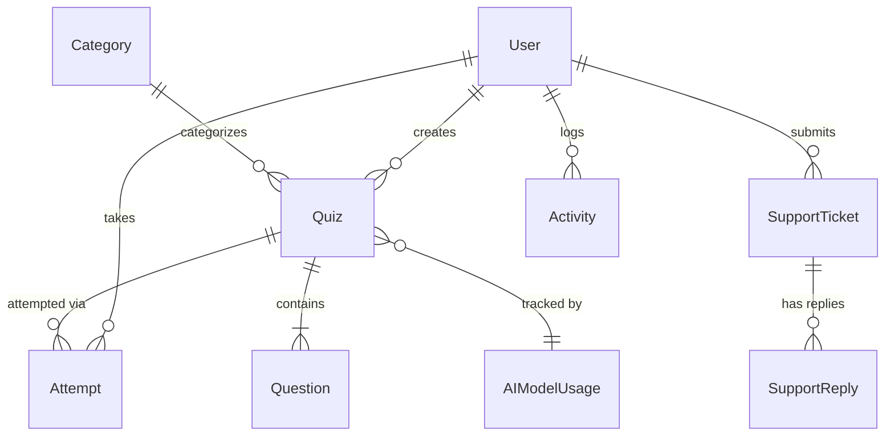

<p align="center">
  <h1 align="center">🧠 QuizOasis</h1>
  <p align="center">
    <strong>The Modern Interactive Quiz Platform</strong>
  </p>
  <p align="center">
    Create, share, and take quizzes with a beautiful modern interface.<br/>
    AI-powered quiz generation · Real-time analytics · Competitive leaderboard.
  </p>
  <p align="center">
    
    
    
    
    
    
    
  </p>
</p>

---

## ✨ Features

### 🎮 For Users
- **Create Quizzes** — Build quizzes with multiple-choice questions, set time limits, categories, and difficulty levels
- **✨ AI Quiz Generator** — Auto-generate structured quizzes in seconds using the **Google Gemini API** with multi-model fallback and smart rotation
- **🤖 AI Generation Limits** — Per-user daily limit of **10 AI generations/day**, tracked in real-time with a visual ring gauge on the dashboard and a badge on the quizzes page
- **✨ GenAI Attribution** — AI-generated quizzes are clearly marked with a **"✨ Generated by GenAI"** badge across the dashboard and quiz list pages
- **Take Quizzes** — Attempt quizzes from the explore page with a clean, distraction-free quiz interface
- **📊 Dashboard** — Premium light-themed dashboard with animated metric cards, gradient area chart for score history, doughnut accuracy gauge, trade-log activity feed, and AI usage ring gauge
- **Leaderboard** — Global leaderboard to compete with other users and track rankings
- **Support Tickets** — Built-in support system to raise and track issues

### 👤 Profile Management
- **Profile Page** — Dedicated profile page with glassmorphism design and two-column responsive layout
- **Personal Info** — Update full name, email, and bio with server-side validation
- **Avatar Upload** — Upload custom profile pictures (JPG, PNG, WebP) with live preview. **Avatars display globally** across dashboards, leaderboards, quiz explore pages, and admin tables.
- **Password Change** — Secure password change with current password verification and complexity policy
- **Profile Completion** — Visual progress bar showing how complete your profile is
- **Navbar Dropdown** — Profile picture in the navbar with a sleek dropdown menu for quick navigation

### 🔐 Authentication
- **Email/Password Login** — Traditional registration and login with secure password hashing
- **Google Sign-In** — One-click Google authentication via Firebase with server-side token verification
- **Account Linking** — Existing email users can link their Google account seamlessly
- **OAuth Protection** — Google users are prevented from changing passwords (no password set)
- **Suspended User Blocking** — Suspended accounts are blocked at login for both auth methods

### 🛡️ For Admins
- **Admin Dashboard** — Overview of platform stats, user activity, and system health
- **User Management** — View, activate, suspend, or manage all registered users
- **Quiz Management** — Monitor, review, and moderate quizzes across the platform
- **Ticket Management** — Respond to and resolve user support tickets
- **Activity Logs** — Track all important actions and events across the platform
- **AI Usage Dashboard** — Monitor Gemini model calls, failures, fallback activity, and per-model success rates with daily/total breakdowns
- **Admin Stats on Profile** — Admins see platform-wide stats (users, quizzes, activities, tickets) on their profile page

---

## 🤖 AI Quiz Generation

QuizOasis integrates with the **Google Gemini API** for intelligent quiz generation:

| Feature | Details |
|---------|---------|
| **Multi-Model Fallback** | Cycles through `gemini-2.5-flash`, `gemini-2.5-pro`, `gemini-1.5-flash`, `gemini-1.5-pro` on failure |
| **Smart Rotation** | Round-robin model selector with automatic cooldown after rate limits |
| **Daily Limit** | **10 generations per user per day** — enforced server-side with a `429` response when exceeded |
| **Real-Time Tracking** | SVG ring gauge on the dashboard + color-coded badge on My Quizzes page |
| **GenAI Badge** | AI-generated quizzes are tagged with `is_ai_generated` in the database and display a "✨ Generated by GenAI" label |
| **Usage Analytics** | Admin AI Usage Dashboard shows per-model success/failure rates, daily call counts, and model health status |
| **Configurability** | Retry count, timeout, cooldown, daily limit — all configurable in `config.py` |

---

## 📊 Dashboard

The user dashboard features a premium **light-themed stock-terminal aesthetic**:

- **5 Metric Cards** — Quizzes Played, Avg Accuracy %, Best Score %, Quizzes Created, and AI Gens Left (with SVG ring gauge)
- **AI Usage Pill** — Header badge showing `✨ AI X/10 left today` with color coding
- **Performance Chart** — Gradient area chart (Chart.js) for score history across attempts
- **Accuracy Gauge** — Doughnut chart with 75% cutout and center percentage
- **Activity Feed** — Trade-log style feed with color-coded status dots (green/yellow/red)
- **My Quizzes Strip** — Compact quiz list with status badges, play counts, and GenAI labels
- **Animated Counters** — Numbers count up on page load for a polished first impression
- **Skeleton Loaders** — Smooth skeleton → real content transition

---

## 🏗️ Tech Stack

| Layer          | Technology                                                                 |
|----------------|---------------------------------------------------------------------------|
| **Backend**    | [Flask 3.0](https://flask.palletsprojects.com/) — Lightweight Python web framework |
| **Database**   | [PostgreSQL](https://www.postgresql.org/) via [SQLAlchemy](https://www.sqlalchemy.org/) ORM |
| **Migrations** | [Flask-Migrate](https://flask-migrate.readthedocs.io/) (Alembic)          |
| **Auth**       | [Flask-Login](https://flask-login.readthedocs.io/) — Session-based authentication |
| **Google Auth**| [Firebase Admin SDK](https://firebase.google.com/docs/admin/setup) — Server-side token verification |
| **AI Engine**  | [Google Gemini API](https://ai.google.dev/) (`google-genai`) — Multi-model fallback with round-robin rotation |
| **Charts**     | [Chart.js 4.4](https://www.chartjs.org/) — Interactive dashboard charts    |
| **Frontend**   | HTML5 + Vanilla CSS + JavaScript — Custom glassmorphism design system      |

---

## 📁 Project Structure

```
QuizOasis/
├── app/
│   ├── __init__.py            # App factory & extension init
│   ├── config.py              # Configuration (AI limits, Gemini models, etc.)
│   ├── models/                # Database models
│   │   ├── user.py            #   User accounts (email & Google auth)
│   │   ├── quiz.py            #   Quizzes (with is_ai_generated flag)
│   │   ├── question.py        #   Quiz questions
│   │   ├── attempt.py         #   Quiz attempts & scores
│   │   ├── category.py        #   Quiz categories
│   │   ├── support.py         #   Support tickets & replies
│   │   ├── activity.py        #   Activity logs (tracks AI generations per user)
│   │   └── ai_usage.py        #   AI model usage metrics (calls, failures, status)
│   ├── routes/                # Route blueprints
│   │   ├── auth_routes.py     #   Login, register, logout, Google login
│   │   ├── dashboard_routes.py#   User dashboard with AI usage data
│   │   ├── quiz_routes.py     #   CRUD for quizzes + AI generate & save
│   │   ├── attempt_routes.py  #   Taking & submitting quizzes
│   │   ├── leaderboard_routes.py # Global leaderboard
│   │   ├── support_routes.py  #   Support tickets
│   │   ├── admin_routes.py    #   Admin panel + AI usage dashboard
│   │   ├── profile_routes.py  #   Profile management
│   │   └── main_routes.py     #   Landing page
│   ├── services/              # Business logic layer
│   │   ├── auth_service.py    #   User registration
│   │   ├── quiz_service.py    #   Quiz CRUD (supports is_ai_generated)
│   │   ├── ai_quiz_service.py #   Gemini integration, model rotation, daily limits
│   │   ├── attempt_service.py #   Quiz attempt processing
│   │   ├── activity_service.py#   Activity logging
│   │   ├── support_service.py #   Support ticket management
│   │   └── profile_service.py #   Profile updates, avatar, password
│   ├── templates/             # Jinja2 HTML templates
│   │   ├── base.html          #   Base layout with navbar dropdown
│   │   ├── index.html         #   Landing page
│   │   ├── auth/              #   Login & register (with Google button)
│   │   ├── dashboard/         #   Light-themed dashboard with AI ring gauge
│   │   ├── quiz/              #   Quiz CRUD, explore, AI Generate, & quiz list
│   │   ├── attempt/           #   Quiz attempt interface
│   │   ├── leaderboard/       #   Leaderboard page
│   │   ├── support/           #   Support ticket pages
│   │   ├── admin/             #   Admin panel + AI usage dashboard
│   │   └── profile/           #   Profile management page
│   ├── static/                # CSS, uploads
│   │   ├── css/style.css      #   Design system & all styles
│   │   └── uploads/           #   User-uploaded profile pictures
│   └── utils/                 # Helper utilities
│       ├── decorators.py      #   Auth & role decorators
│       └── firebase.py        #   Firebase token verification
├── migrations/                # Alembic database migrations
├── run.py                     # Application entry point
├── requirements.txt           # Python dependencies
├── seedadmin.py               # Admin user seeder script
└── .env                       # Environment variables (not committed)
```

---

## 🚀 Getting Started

### Prerequisites

- **Python 3.10+** installed on your system
- **PostgreSQL** database server
- **pip** (Python package manager)
- **Git**
- **Firebase project** (for Google authentication)
- **Google Gemini API key** (for AI quiz generation)

### Installation

1. **Clone the repository**
   ```bash
   git clone https://github.com/ragnarStark79/quizz-app.git
   cd quizz-app
   ```

2. **Create a virtual environment**
   ```bash
   python -m venv venv
   source venv/bin/activate        # macOS / Linux
   # venv\Scripts\activate         # Windows
   ```

3. **Install dependencies**
   ```bash
   pip install -r requirements.txt
   ```

4. **Set up environment variables**

   Create a `.env` file in the root directory:
   ```env
   # Database
   SQLALCHEMY_DATABASE_URI=postgresql+psycopg://localhost/quizz_db

   # Flask
   SECRET_KEY=your-secret-key-here
   FLASK_APP=run.py
   FLASK_ENV=development

   # Firebase
   FIREBASE_CREDENTIALS=path/to/serviceAccountKey.json
   FIREBASE_API_KEY=your-firebase-api-key
   FIREBASE_AUTH_DOMAIN=your-project.firebaseapp.com
   FIREBASE_PROJECT_ID=your-project-id

   # Google Gemini AI
   GEMINI_API_KEY=your_gemini_api_key
   ```

5. **Set up Firebase** *(for Google authentication)*
   - Create a project at [Firebase Console](https://console.firebase.google.com/)
   - Enable **Google** sign-in under Authentication → Sign-in method
   - Download your **Service Account Key** JSON and place it at the path specified in `.env`
   - Copy your **Web app config** values into the `.env` file

6. **Initialize the database**
   ```bash
   flask db upgrade
   ```

7. **Seed the admin user** *(optional)*
   ```bash
   python seedadmin.py
   ```

8. **Run the application**
   ```bash
   python run.py
   ```

9. **Open in browser**
   ```
   http://127.0.0.1:5000
   ```

---

## ⚙️ Configuration

All AI and app configuration is centralized in `app/config.py`:

| Setting | Default | Description |
|---------|---------|-------------|
| `AI_DAILY_LIMIT` | `10` | Maximum AI quiz generations per user per day |
| `GEMINI_MODELS` | `['gemini-2.5-flash', ...]` | Model priority list for fallback |
| `GEMINI_FALLBACK_ENABLED` | `True` | Enable multi-model fallback on failure |
| `GEMINI_MAX_RETRIES` | `3` | Max retry attempts per generation |
| `GEMINI_TIMEOUT` | `60` | Seconds before an API call times out |
| `GEMINI_COOLDOWN_MINUTES` | `5` | Cooldown period after a rate-limit hit |

---

## 📸 Application Overview

| Page              | Description                                                  |
|-------------------|--------------------------------------------------------------|
| **Landing Page**  | Modern hero section with feature cards and CTA buttons       |
| **Login/Register**| Email/password + Google sign-in with Firebase                 |
| **Dashboard**     | Light-themed cards, gradient area chart, accuracy doughnut, AI ring gauge |
| **Explore**       | Browse and search available quizzes with filters             |
| **Quiz Builder**  | Create quizzes with questions, options, and settings          |
| **AI Generator**  | Generate quizzes with Gemini — topic, difficulty, question count |
| **Quiz Attempt**  | Clean interface for taking quizzes with progress bar         |
| **My Quizzes**    | Manage created quizzes with AI limit badge and GenAI labels  |
| **Leaderboard**   | Global user rankings by score with medal icons               |
| **Profile**       | Personal info, avatar upload, password change, account details|
| **Admin Panel**   | Full admin dashboard with user, quiz, ticket, and AI usage management |
| **Support**       | Submit and track support tickets with chat-style threads     |

---

## 🔐 Authentication Flow

```
┌─────────────────────────────────────────────────┐
│                   Login Page                     │
│                                                  │
│   ┌──────────────────────────────────────────┐   │
│   │       Email / Password Form              │   │
│   │       ─────────────────────              │   │
│   │       Flask-Login session auth           │   │
│   └──────────────────────────────────────────┘   │
│                                                  │
│          ── or continue with ──                  │
│                                                  │
│   ┌──────────────────────────────────────────┐   │
│   │       🔵 Sign in with Google             │   │
│   │       ─────────────────────              │   │
│   │   Firebase SDK → ID Token → Flask API    │   │
│   │   → Server-side verification → Session   │   │
│   └──────────────────────────────────────────┘   │
└─────────────────────────────────────────────────┘
```

---

## 👥 User Roles

| Role       | Capabilities                                                                 |
|------------|-----------------------------------------------------------------------------|
| **User**   | Register, login (email or Google), create quizzes, generate AI quizzes (10/day), take quizzes, manage profile, view dashboard & leaderboard |
| **Admin**  | All user capabilities + manage users, quizzes, tickets, view activity logs, AI usage monitoring, admin stats on profile |

---

## 🧪 Database Models



---

## 🎨 Design System

The application uses a custom **glassmorphism design system** built with vanilla CSS:

- **Color Palette** — Creamy gradient background (`#fdfcfb → #e2d1c3`), soft indigo accent (`#6366f1`)
- **Dashboard Theme** — Light professional aesthetic (`#f8fafc` background, `#ffffff` cards, indigo accents)
- **25+ CSS Variables** — Design tokens for colors, spacing, shadows, and border radii
- **Glassmorphism Cards** — `backdrop-filter: blur(20px)` with soft borders and hover lift effects
- **Floating Blobs** — Radial gradient pseudo-elements for premium visual depth
- **Animations** — `fadeIn`, `fadeSlideUp`, `scaleIn` with stagger support
- **Responsive** — Mobile-first with hamburger nav and adaptive layouts
- **Premium Tables** — Glass tables that transform into stacked cards on mobile

---

## 🤝 Contributing

Contributions are welcome! Here's how:

1. Fork the repository
2. Create a feature branch (`git checkout -b feature/amazing-feature`)
3. Commit your changes (`git commit -m 'Add amazing feature'`)
4. Push to the branch (`git push origin feature/amazing-feature`)
5. Open a Pull Request

---

## 📄 License

This project is open source and available under the [MIT License](LICENSE).

---

<p align="center">
  Made by Ragnar Stark using Flask
</p>
