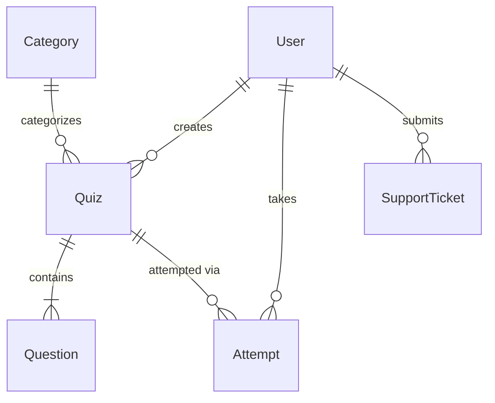

<p align="center">
  <h1 align="center">🧠 Quizz</h1>
  <p align="center">
    <strong>The Modern Interactive Quiz Platform</strong>
  </p>
  <p align="center">
    Create, share, and take quizzes with a beautiful modern interface.<br/>
    Track your progress and compete on the leaderboard.
  </p>
  <p align="center">
    
    
    
    
    
  </p>
</p>

---

## ✨ Features

### 🎮 For Users
- **Create Quizzes** — Build quizzes with multiple-choice questions, set time limits, categories, and difficulty levels
- **Take Quizzes** — Attempt quizzes from the explore page with a clean, distraction-free quiz interface
- **Dashboard** — Personal dashboard with animated stat cards, score history charts, and accuracy breakdowns
- **Leaderboard** — Global leaderboard to compete with other users and track rankings
- **Support Tickets** — Built-in support system to raise and track issues

### 🛡️ For Admins
- **Admin Dashboard** — Overview of platform stats, user activity, and system health
- **User Management** — View, activate, suspend, or manage all registered users
- **Quiz Management** — Monitor, review, and moderate quizzes across the platform
- **Ticket Management** — Respond to and resolve user support tickets
- **Activity Logs** — Track all important actions and events across the platform

---

## 🏗️ Tech Stack

| Layer          | Technology                                                                 |
|----------------|---------------------------------------------------------------------------|
| **Backend**    | [Flask 3.0](https://flask.palletsprojects.com/) — Lightweight Python web framework |
| **Database**   | [SQLAlchemy](https://www.sqlalchemy.org/) + SQLite (dev) / PostgreSQL (prod) |
| **Migrations** | [Flask-Migrate](https://flask-migrate.readthedocs.io/) (Alembic)          |
| **Auth**       | [Flask-Login](https://flask-login.readthedocs.io/) — Session-based authentication |
| **Firebase**   | [Firebase Admin SDK](https://firebase.google.com/docs/admin/setup) — Additional services |
| **Charts**     | [Chart.js 4.4](https://www.chartjs.org/) — Interactive dashboard charts    |
| **Frontend**   | HTML5 + Vanilla CSS + JavaScript — Custom design system with glassmorphism |

---

## 📁 Project Structure

```
Quizz/
├── app/
│   ├── __init__.py            # App factory & extension init
│   ├── config.py              # Configuration settings
│   ├── models/                # Database models
│   │   ├── user.py            #   User accounts
│   │   ├── quiz.py            #   Quizzes
│   │   ├── question.py        #   Quiz questions
│   │   ├── attempt.py         #   Quiz attempts & scores
│   │   ├── category.py        #   Quiz categories
│   │   ├── support.py         #   Support tickets
│   │   └── activity.py        #   Activity logs
│   ├── routes/                # Route blueprints
│   │   ├── auth_routes.py     #   Login, register, logout
│   │   ├── dashboard_routes.py#   User dashboard
│   │   ├── quiz_routes.py     #   CRUD for quizzes
│   │   ├── attempt_routes.py  #   Taking & submitting quizzes
│   │   ├── leaderboard_routes.py # Global leaderboard
│   │   ├── support_routes.py  #   Support tickets
│   │   ├── admin_routes.py    #   Admin panel
│   │   └── main_routes.py     #   Landing page
│   ├── services/              # Business logic layer
│   ├── templates/             # Jinja2 HTML templates
│   │   ├── base.html          #   Base layout
│   │   ├── index.html         #   Landing page
│   │   ├── auth/              #   Login & register pages
│   │   ├── dashboard/         #   User dashboard
│   │   ├── quiz/              #   Quiz CRUD & explore
│   │   ├── attempt/           #   Quiz attempt interface
│   │   ├── leaderboard/       #   Leaderboard page
│   │   ├── support/           #   Support ticket pages
│   │   └── admin/             #   Admin panel pages
│   ├── static/                # CSS, JS, images
│   └── utils/                 # Helper utilities
├── migrations/                # Alembic database migrations
├── run.py                     # Application entry point
├── requirements.txt           # Python dependencies
├── seedadmin.py               # Admin user seeder script
└── .env                       # Environment variables (not committed)
```

---

## 🚀 Getting Started

### Prerequisites

- **Python 3.10+** installed on your system
- **pip** (Python package manager)
- **Git**

### Installation

1. **Clone the repository**
   ```bash
   git clone https://github.com/ragnarStark79/quizz-app.git
   cd quizz-app
   ```

2. **Create a virtual environment**
   ```bash
   python -m venv venv
   source venv/bin/activate        # macOS / Linux
   # venv\Scripts\activate         # Windows
   ```

3. **Install dependencies**
   ```bash
   pip install -r requirements.txt
   ```

4. **Set up environment variables**

   Create a `.env` file in the root directory:
   ```env
   SECRET_KEY=your-secret-key-here
   DATABASE_URL=sqlite:///quizz.db
   FIREBASE_CREDENTIALS=path/to/firebase-credentials.json
   ```

5. **Initialize the database**
   ```bash
   flask db upgrade
   ```

6. **Seed the admin user** *(optional)*
   ```bash
   python seedadmin.py
   ```

7. **Run the application**
   ```bash
   python run.py
   ```

8. **Open in browser**
   ```
   http://127.0.0.1:5000
   ```

---

## 📸 Application Overview

| Page              | Description                                                  |
|-------------------|--------------------------------------------------------------|
| **Landing Page**  | Modern hero section with feature cards and CTA buttons       |
| **Dashboard**     | Animated stats, score history bar chart, accuracy doughnut   |
| **Explore**       | Browse and search available quizzes                          |
| **Quiz Builder**  | Create quizzes with questions, options, and settings          |
| **Quiz Attempt**  | Clean interface for taking quizzes with timer support         |
| **Leaderboard**   | Global user rankings by score                                |
| **Admin Panel**   | Full admin dashboard with user, quiz, and ticket management  |
| **Support**       | Submit and track support tickets                             |

---

## 🔐 User Roles

| Role       | Capabilities                                                                 |
|------------|-----------------------------------------------------------------------------|
| **User**   | Register, login, create quizzes, take quizzes, view dashboard & leaderboard |
| **Admin**  | All user capabilities + manage users, quizzes, tickets, view activity logs   |

---

## 🧪 Database Models



---

## 🤝 Contributing

Contributions are welcome! Here's how:

1. Fork the repository
2. Create a feature branch (`git checkout -b feature/amazing-feature`)
3. Commit your changes (`git commit -m 'Add amazing feature'`)
4. Push to the branch (`git push origin feature/amazing-feature`)
5. Open a Pull Request

---

## 📄 License

This project is open source and available under the [MIT License](LICENSE).

---

<p align="center">
  Made with ❤️ using Flask
</p>
